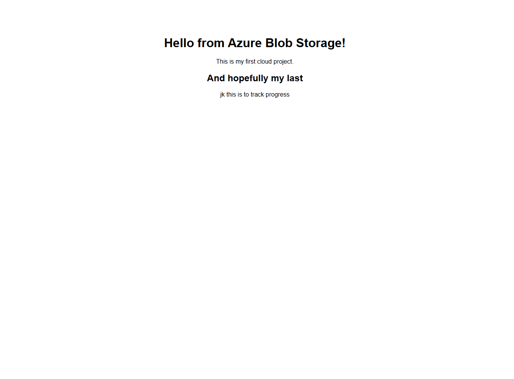

# Azure Static Website Project

## This is a simple static website hosted on Azure Blob Storage using the Azure Free Tier.
  Technologies Used
- Azure Blob Storage
- Static Website Hosting
- HTML

 ##  What I Did
1. Created an Azure Storage Account
2. Enabled Static Website Hosting
3. Uploaded `index.html` to the `$web` container
4. Deployed the site publicly using the Azure-provided URL

## Live Site
[Visit the website](https://lowcostredunblob.z20.web.core.windows.net/)

## 🚀 Future Improvements
- Add CSS for design
- Automate deployment using Azure CLI or GitHub Actions
- Link a custom domain with HTTPS
- Expand the site with multiple pages or forms
